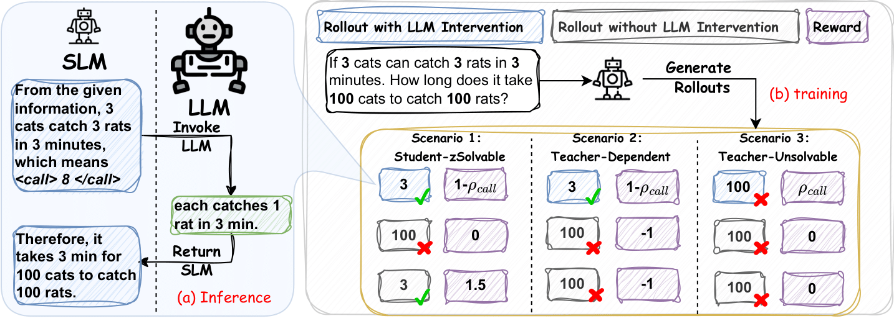

# RelayLLM: Efficient Reasoning via Collaborative Decoding

> Empower Small Language Models (SLMs) to act as active controllers, invoking Large Language Models (LLMs) only for critical tokens. Achieve expert-level reasoning with minimal cost.

Check out our [paper](https://arxiv.org/abs/XXXX.XXXXX)for the details.

## 🔥 Updates

- **[2026-01-08]** We released our [paper](https://arxiv.org/abs/XXXX.XXXXX) and code. RelayLLM achieves **98.2%** cost reduction compared to random routers while bridging the performance gap between SLMs and LLMs!

## 🧩 Overview



Deploying Large Language Models (LLMs) for complex reasoning is often hindered by high computational costs and latency. Existing "routing" approaches operate at a coarse granularity (offloading entire queries), leading to significant waste when the small model could have handled most of the steps.

**RelayLLM** is a novel framework for **token-level collaborative decoding**. Unlike passive routers, RelayLLM empowers the SLM to act as an **active controller**. It dynamically invokes the LLM only for critical tokens via a special `<call>` command, effectively "relaying" the generation process to the expert when necessary.

Our approach utilizes a two-stage training framework combining **Supervised Warm-up** and **Group Relative Policy Optimization (GRPO)** to teach the model to balance independence with strategic help-seeking.

### Key Features
* **Token-Level Granularity:** Collaboration happens within the generation stream via interleaved decoding, not just at the query level.
* **Active Control:** The SLM autonomously decides *when* and *how long* to call the LLM using a learned `<call>` token.
* **Extreme Efficiency:** Reduces token costs by **98.2%** compared to performance-matched routers, invoking the LLM for only **~1%** of total generated tokens.
* **Difficulty-Aware Reward:** A specialized RL reward system designed to encourage independence on easy tasks (Student-Solvable) and help-seeking only on hard ones (Teacher-Dependent).
* **Bridged Performance:** Recovers ~60% of the performance gap between the SLM and LLM on challenging math benchmarks.

---

## ⚡️ Quickstart Guide

Getting started with RelayLLM is straightforward.

### 1. Configure Environment and Prepare Dirs
```bash
git clone https://github.com/Chengsong-Huang/RelayLLM.git

# Navigate into the new directory
cd RelayLLM
# Install the required packages
pip install -r requirements.txt

# We use vLLM for efficient teacher model serving
pip install vllm

# Create storage directories
export STORAGE_PATH="/path/to/your/storage"
```
If you meet any problems, please refer to [installation for verl](https://verl.readthedocs.io/en/latest/start/install.html)

### 2. Configure Environment and Prepare Dirs
``` bash
# run the example codes
sh example.bash
```

## 📊 Impressive Results

The table below compares RelayLLM against the Base SLM, GRPO baseline, and other routing methods (CITER). Results are averaged across six benchmarks (Minerva, MATH-500, GSM8K, Olympiad-Bench, AIME-2024, AIME-2025).

| Model Family | Method | Avg. Accuracy (%) | Avg. Call Ratio (%) |
|:---|:---|:---:|:---:|
| **Qwen3-0.6B** | Base Model | 27.17 | - |
| | GRPO Baseline | 29.91 | - |
| | CITER (Token-Level) | 30.77 | 0.98% |
| | **RelayLLM (Ours)** | **33.04** | **0.77%** |
| **Qwen3-1.7B** | Base Model | 42.50 | - |
| | GRPO Baseline | 44.06 | - |
| | CITER (Token-Level) | 46.81 | 1.34% |
| | **RelayLLM (Ours)** | **49.52** | **1.07%** |
| **Qwen3-8B** | **Teacher LLM** | **54.12** | **100%** |

*Note: RelayLLM (Difficulty-Aware) achieves the best trade-off, recovering significant performance with negligible token overhead (~1%).*

## 🙏 Acknowledgements

Our framework is directly based on the great work of [**EasyR1**](https://github.com/hiyouga/EasyR1/tree/main), implementing all of its core functionalities. Additionally, our evaluation process referenced the work from [**General-Reasoner**](https://github.com/TIGER-AI-Lab/General-Reasoner). We are very grateful for their excellent work.

## 💬 Citation
If our work is useful for you, please consider citing our paper:
``` 
```
